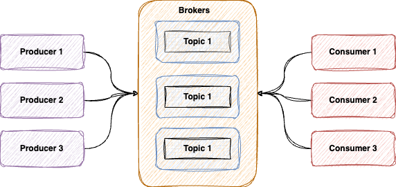
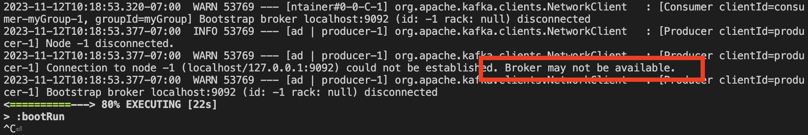
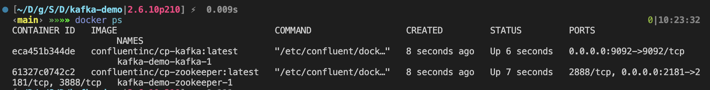
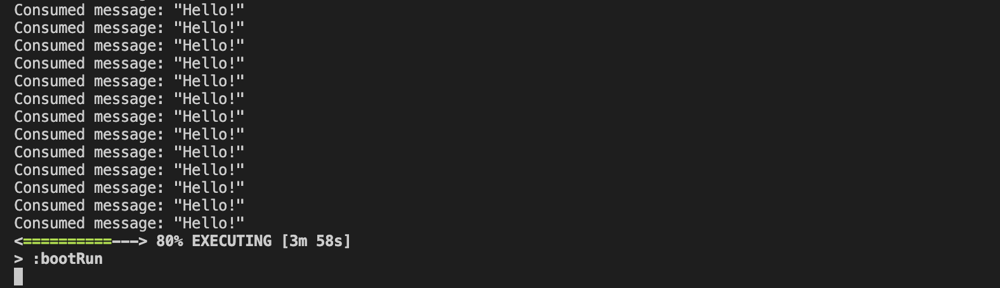

### **Brief Overview**
---

### What is Kafka?

Apache [Kafka](https://kafka.apache.org/) is a distributed streaming platform that allows you to publish and subscribe to streams of records, store streams of records in a fault-tolerant way, and process streams of records as they occur. It is designed to handle real-time data feeds with low latency and high reliability.

In Kafka, a stream is an ordered, replayable, and fault-tolerant sequence of immutable data records. Each data record in the stream is known as a message. Kafka maintains feeds of messages in categories called topics.

Kafka operates based on the publish-subscribe pattern, also known as Pub-Sub. 

In this messaging pattern, senders (publishers) categorize published messages into topics without knowing the receivers (subscribers). Similarly, subscribers express interest in one or more topics and only receive messages that are of interest, without knowing the publishers. 

You can read more about this architecture [here](https://ably.com/topic/pub-sub#the-pub-sub-model-explained).

**Architecture**

A typical Kafka architecture is based on a distributed and partitioned commit log service. It has four core APIs: the Producer API, the Consumer API, the Streams API, and the Connect API. Kafka clusters are run as a set of servers, and each server can handle reads and writes to topics. Read more [here](https://kafka.apache.org/documentation/#connect).



### Key Components

**Producer:**
A [Producer](https://kafka.apache.org/documentation/#producerapi) is an application that sends messages to a Kafka topic. It is responsible for choosing which record to assign to which partition within the topic.

**Consumer:**
A [Consumer](https://kafka.apache.org/documentation/#consumerapi) is an application that reads and processes messages from a Kafka topic. It can subscribe to one or more topics and consume data from the partitions of these topics.

**Topic:**
A [Topic](https://kafka.apache.org/documentation/#intro_topics) is a category or feed name to which messages are published. Topics in Kafka are always multi-subscriber; that is, a topic can have zero, one, or many consumers that subscribe to the data written to it.

**Partition:**
A [Partition](https://kafka.apache.org/documentation/#intro_topics) is a subset of the data in a topic. Partitions allow for data to be parallelized across multiple brokers, allowing for high levels of throughput.

**Consumer Group:**
A [Consumer Group](https://kafka.apache.org/documentation/#intro_consumers) consists of one or more consumers that jointly consume data from a topic. Each consumer in the group is assigned a set of partitions from the topic so that each message is delivered to one consumer in the group.

### When to use?
- **Real-time Processing:**
Kafka can be used to develop real-time streaming applications that can transform or react to the streams of data.

- **Log Aggregation:**
Kafka can be used across an organization to collect logs from multiple services and make them available in a standard format to multiple consumers.

- **Stream Processing:**
With Kafka, you can process data in real-time directly from the stream as it is produced or consumed.

### **Getting Started**
---

In this section, we will guide you through the process of setting up your environment to work with Kafka, including installing the necessary software and creating a simple Kafka Producer/Consumer application with Spring Boot.

### Installation 

**Prerequisites**
- Basic understanding of Java programming language
- Basic understanding of Command Line Interface (CLI)
- Java Development Kit (JDK) installed on your system
- Docker installed on your system (for Kafka Cluster setup)
- An IDE such as IntelliJ IDEA or Eclipse or VS Code
- Familiarity with concepts of distributed systems (optional but helpful)

**Setup**

Go ahead and create a new Spring boot project. 

We will use JDK 17 and Gradle as the build tool for our project.
- [Java Development Kit (JDK) 17](https://www.oracle.com/java/technologies/javase/jdk17-archive-downloads.html)
- [Gradle 7.2 or later](https://gradle.org/)

You can use an IDE for generating the project or use this [link](https://start.spring.io/).

Name the project as **Kafka-demo**.

Add below dependencies:

- [Spring Web](https://mvnrepository.com/artifact/org.springframework/spring-web/6.0.13)
- [Spring for Kafka](https://mvnrepository.com/artifact/org.springframework.kafka/spring-kafka/3.0.12)

**Create a Rest Controller**

Now, we will create a Rest Controller that will provide us with an interface to talk to Kafka as a producer. 

Create a **KafkaController** package as shown below.

```java
package com.module.kafkademo.Controller;

import org.springframework.web.bind.annotation.GetMapping;
import org.springframework.web.bind.annotation.RequestParam;
import org.springframework.web.bind.annotation.RestController;

@RestController
public class KafkaController {

    @GetMapping("/start")
    public void startProducer() {
        
    }
}
```

Now we need a service in the backend that will talk to Kafka and publish the message from the client to a kafka topic.

### Creating a Producer

As discussed before, a Kafka Producer is an entity that publishes messages to one or more Kafka Topics. Producers are responsible for deciding which partition of a topic to assign a message before sending it. This can be done in a round-robin fashion or they can use an algorithm to determine the partition. 

Create a package named **KafkaProducer**.

```java
package com.module.kafkademo.Service;

import org.springframework.beans.factory.annotation.Autowired;
import org.springframework.kafka.core.KafkaTemplate;
import org.springframework.stereotype.Service;

@Service
public class KafkaProducer {
    
    @Autowired
    KafkaTemplate<String, String> kafkaTemplate;

    public void startProducer() {
        while (true) {
            this.kafkaTemplate.send("myTopic", "Hello!");
            try {
                Thread.sleep(1000);
            } catch (InterruptedException e) {
                e.printStackTrace();
            }
        }
    }
}
```

This code will be responsible to make a connection with the kafka cluster and send all the messages from the client to a dedicated topic.

Now update the **KafkaController** class with below code to invoke the newly created service to publish message on kafka topic.

```java
public class KafkaController {

    @Autowired
    private KafkaProducer producer;

    @GetMapping("/start")
    public void startProducer() {
        this.producer.startProducer();
    }
}
```


### Creating a Consumer

A Kafka Consumer is an entity that consumes the messages published by a producer application. Consumers subscribe (listen) to one or more Kafka Topics and constantly consume data. Consumers can be assigned a group to improve message consumption by parallel consumption. Each consumer in a group is assigned a set of partitions from the topic so that no two consumers are consuming the same message. 

Create a package named **KafkaConsumer** and add below code.

```java
package com.module.kafkademo.Service;

import org.springframework.kafka.annotation.KafkaListener;
import org.springframework.stereotype.Service;

@Service
public class KafkaConsumer {
    
    @KafkaListener(topics = "myTopic", groupId = "myGroup")
    public void consume(String message) {
        System.out.println("Consumed message: " + message);
    }
}
```

### Configuring Kafka

Now that we have a producer and a consumer ready to be running, we will configure our spring boot application with information about the Kafka cluster. This file basically tells spring boot how to serialize the data before sending it to kafka.

Go ahead and modify the **application.properties** file under the **/resources** directory and add below.

```txt
spring.kafka.producer.bootstrap-servers=localhost:9092
spring.kafka.producer.key-serializer=org.apache.kafka.common.serialization.StringSerializer
spring.kafka.producer.value-serializer=org.springframework.kafka.support.serializer.JsonSerializer
```

Awesome! Now go ahead and run you application with `./gradlew bootRun`.

Did you see an error? 



We created our producer and consumer but there is no Kafka Cluster yet for Spring boot to send data to.

In our next step, we will launch a mini kafka cluster for this demo. Go ahead and start your Docker engine.

### Launching a mini Kafka Cluster

A Kafka cluster consists of multiple components as described in the architecture. However, for this simple tutorial, we will focus on 3 main components.
1. A set of Kafka Brokers
2. Kafka Zookeeper
3. Kafka Topic

In this tutorial, we are using [Docker](https://www.docker.com/). Docker is a containerization platform that makes it easy to pack your applications in the form of an image and run them as containers.

In your project root directory, create a file named **docker-compose.yml**.

```yaml
version: '3.1'
services:
  zookeeper:
    image: confluentinc/cp-zookeeper:latest
    environment:
      - ZOOKEEPER_CLIENT_PORT=2181
    ports:
      - 2181:2181

  kafka:
    image: confluentinc/cp-kafka:latest
    depends_on:
      - zookeeper
    ports:
      - 9092:9092
    environment:
      - KAFKA_BROKER_ID=1
      - KAFKA_ZOOKEEPER_CONNECT=zookeeper:2181
      - KAFKA_ADVERTISED_LISTENERS=PLAINTEXT://localhost:9092
      - KAFKA_OFFSETS_TOPIC_REPLICATION_FACTOR=1
      - KAFKA_INTER_BROKER_LISTENER_NAME=PLAINTEXT
```

This file helps you get a mini kafka cluster up and running as docker containers with a single command.

`docker-compose up -d`

Verify that a kafka cluster is running in your system. If you are using docker desktop, go to the **containers** tab. You should be able to see your Cluster running.

Alternatively, you can run this command to verify.

`docker ps`



### Running the Application

We will try one more time to run the application and this time it should work.

`./gradlew bootRun`

Now we suggest you to have split screen window enabled in your system. Have a terminal (one running your spring boot server) on one side, and an API tool ([Postman](https://www.postman.com/downloads/), [Insomnia](https://insomnia.rest/download)) on the other.

Navigate to the url we had configured in our **KafkaController** and add a request parameter with the message. Use the HTTP GET Method.

`http://localhost:8080/start`

Now on the right side in your teminal, you should see `Consumed message: test message`.



In this way we created a simple demo app for Kafka, with a producer and consumer.

**Follow up assignment:**

Try to include the spring boot application to the same docker-compose and make them communicate among themselves via a network.

**Clean up**

Once you're done with your Kafka cluster, you can stop and remove the Docker containers by running the following command:

`docker-compose down`

### Best Practices

After going through multiple resources across the internet, we have combined a set of best practices for maintaining a Kafka Cluster in a production environment.

1. Monitor your Kafka cluster to track resource usage and performance metrics. This can help you identify any potential issues before they become critical.

2. Use replication for fault tolerance. A good practice is to set the replication factor to at least 3 for your topics to allow for one broker to be down.

3. Configure log retention policies based on your storage capacity and data needs. This helps in managing storage space on the Kafka brokers. A value of around 7 days works good for most use cases.

4. Make sure to properly manage your consumer groups. If a consumer fails, Kafka can reassign the partition to another consumer in the same group to ensure that the processing continues.

5. Implement security measures like SSL/TLS for data encryption, and SASL for client authentication.

6. Keep your Kafka cluster up-to-date with the latest patches and versions.

7. Regularly backup your Kafka cluster configuration files. This can help in disaster recovery.

8. Tune Kafka configurations based on your workload. For example, you can adjust the number of I/O threads and network threads based on your requirements.

### **Conclusion**
---

In this tutorial, we have covered the basics of Apache Kafka, including its architecture, core concepts, and use cases. We have also discussed how to get started with Kafka, including setting up a Kafka cluster and creating Kafka Producers and Consumers. 

We have also covered some best practices for running Kafka in a production environment.

Remember, Kafka is a powerful tool for handling real-time data feeds in a fault-tolerant way, and it's essential to understand how to use it effectively and efficiently.